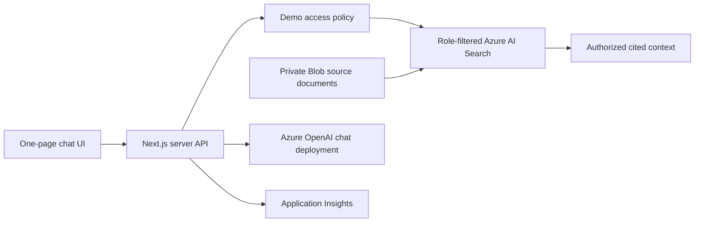

# Architecture

## Purpose

NGCP Central AI is a single-page demo chatbot for three business domains:

- Financial Monitoring
- Planning and Engineering
- IT Project Monitoring

It will use a real Azure OpenAI chat model, but all domain data in the first release is synthetic. The application must not connect to financial, engineering, or IT project production systems during the demo phase.

## Application Design

The application will be a Next.js TypeScript service hosted in Azure Container Apps. Its browser interface will call a server-side `/api/chat` endpoint. That endpoint is the only component allowed to invoke Azure OpenAI.

The browser never receives an Azure OpenAI key, token, Blob credential, Search credential, or unrestricted data set. The active demo role determines the Azure AI Search filter applied before context reaches the model. The server returns only citation metadata for source files that the model explicitly cited.

## Azure Resources

The deployment targets East US and will use the following resources:

| Resource | Purpose |
| --- | --- |
| Azure OpenAI | Hosts a configurable chat model deployment. |
| Azure Storage | Holds private canonical Markdown source documents. |
| Azure AI Search Basic | Stores role-filtered keyword and vector search chunks. |
| Azure Container Apps | Hosts the Next.js service and server-side API. |
| Azure Container Registry | Stores the application container image. |
| User-assigned managed identity | Gives the running application access to Azure services without embedded credentials. |
| Azure Key Vault | Holds a model key only when managed-identity access is unavailable for the selected integration path. |
| Log Analytics and Application Insights | Provide operational health monitoring without conversation payloads. |

Model name, version, capacity, and deployment name are Bicep parameters. They must be validated against the selected subscription's quota and East US availability before deployment.

## Data Handling and Observability

The demo keeps the open conversation only in browser memory. The chat refresh action clears the conversation, draft, errors, and displayed citations while retaining the selected simulated role. Blob Storage is a source-document store only; it does not contain conversation history.

Synthetic records are prominently marked as fictional demo data. Public records are curator-reviewed snapshots containing a concise factual summary, canonical public URL, publication date, retrieval date, and attribution. The application does not crawl or mirror public websites.

Application telemetry may report request duration, status code, model deployment name, and sanitized error categories. It must not record prompts, model responses, role-filtered context, authorization headers, access tokens, API keys, or other secrets.

## Security Boundaries

The role switcher is a visual demonstration, not an authorization control. It is appropriate only because the first release contains synthetic data. Production use requires Microsoft Entra ID authentication, server-side group or app-role claim validation, a policy layer, and source-system permission enforcement.

See [RBAC demonstration](rbac-demo.md) for the demo role matrix and production transition.