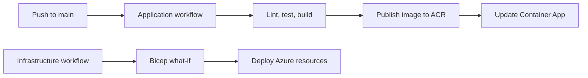

# Deployment

## Target Environment

The demo will deploy to **East US**. Deploying Azure OpenAI requires an Azure subscription with access to Azure OpenAI and sufficient quota for the selected model. Confirm organizational approval and data-residency requirements before using any non-synthetic data.

## Delivery Model

Infrastructure is defined with Bicep. GitHub Actions authenticates to Azure with OpenID Connect (OIDC), avoiding long-lived Azure credentials in repository secrets.



## Planned Resources

The Bicep deployment will create or configure:

- An Azure OpenAI account and a parameterized chat model deployment.
- A private Azure Storage account and Blob container for canonical source records.
- An Azure AI Search Basic service for role-filtered vector and keyword retrieval.
- An Azure Container Apps environment and Container App.
- An Azure Container Registry repository for the service image.
- A user-assigned managed identity and the minimum required role assignments.
- Key Vault, if a secret reference is required by the selected Azure OpenAI client configuration.
- Log Analytics and Application Insights with content collection disabled for prompts and responses.

## One-Time Bootstrap

Before the first GitHub Actions deployment, an Azure administrator must:

1. Select the Azure subscription and create a resource group in East US.
2. Verify Azure OpenAI access, model availability, and quota in that subscription.
3. Create a Microsoft Entra application registration or managed identity used by GitHub Actions.
4. Add a federated credential that trusts the repository and approved branch/environment.
5. Grant that identity the minimum roles needed to deploy the resource group and publish images.
6. Configure the GitHub repository variables used by the workflows, such as subscription ID, tenant ID, resource group, and deployment region.

Do not place Azure client secrets, Azure OpenAI keys, or model endpoint credentials in GitHub repository variables or browser-accessible application configuration.

## Deployment Sequence

1. Validate the Bicep templates with `az bicep build`.
2. Run `az deployment group what-if` against the target resource group.
3. Deploy infrastructure through the infrastructure workflow.
4. Build, test, and publish the application container through the application workflow.
5. Update the Container App to the published image.
6. Validate managed-identity Azure OpenAI access from the deployed service.
7. Verify telemetry excludes chat content and credentials.

## Document Corpus Deployment

`infra/main.bicep` provisions the private Blob container and Azure AI Search service. It disables anonymous Blob access and Storage shared-key access, and disables Search local authentication. The service is public-network reachable only to support local development; private endpoints should be enabled when the hosted path is introduced.

After provisioning, a development identity with **Storage Blob Data Contributor** and **Search Index Data Contributor** runs:

```bash
npm run validate-documents
npm run ingest-documents
```

The ingestion script uploads canonical Markdown files from `demo-documents/`, creates or updates the Search vector index, generates Azure OpenAI embeddings, and indexes role metadata. It is idempotent. The runtime identity is read-only and must not run ingestion.

Every public-source record requires a canonical URL, date, attribution, and manual review. Do not configure a crawler or copy full external articles into the corpus.

## Teardown

The demo should be isolated in its own resource group. When it is no longer needed, remove that resource group to delete the Container App, registry, Azure OpenAI account, monitoring resources, and supporting identity resources deployed there.

Review any shared resources before deletion. A shared registry, Key Vault, or user-assigned managed identity must not be removed until its other consumers are identified.